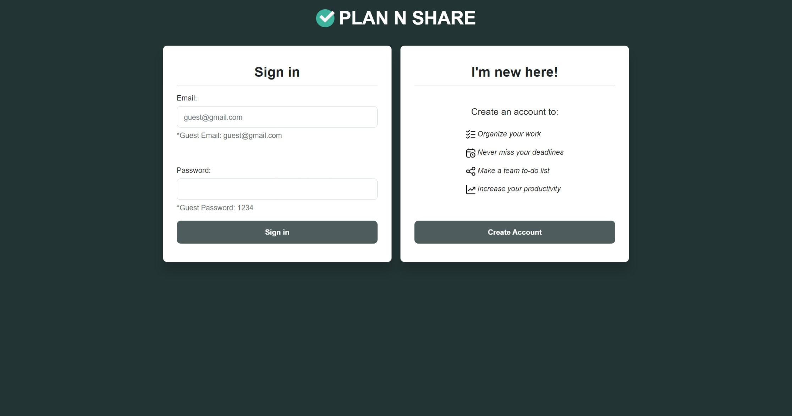
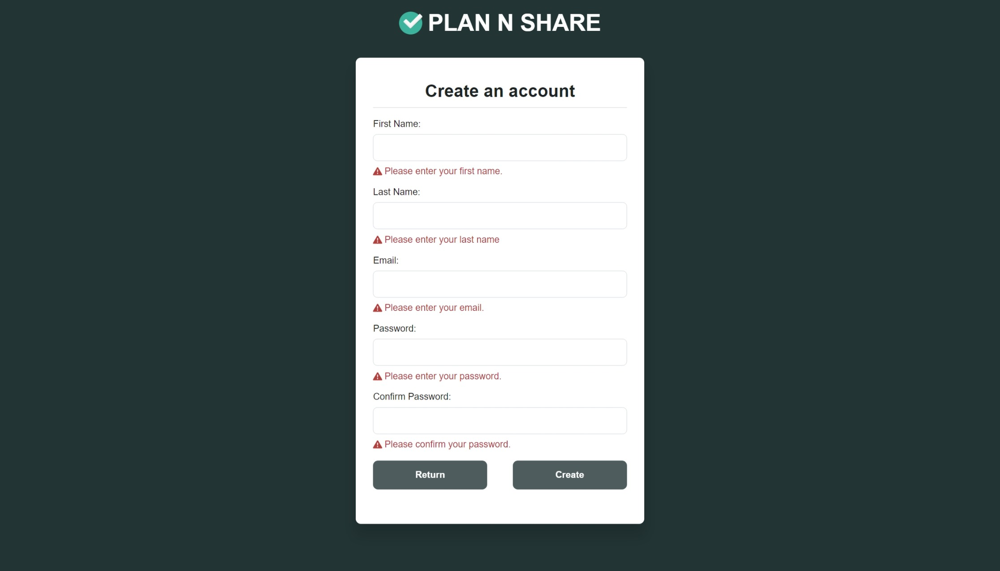
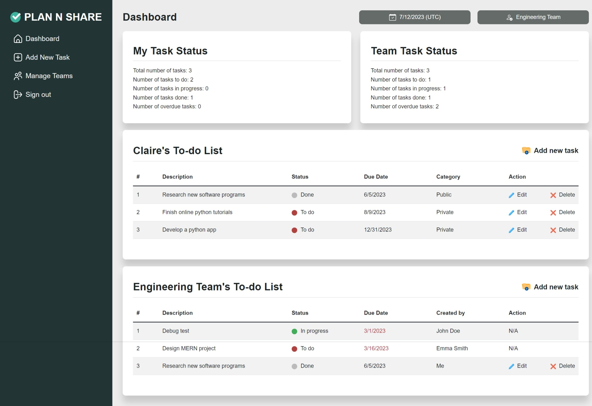
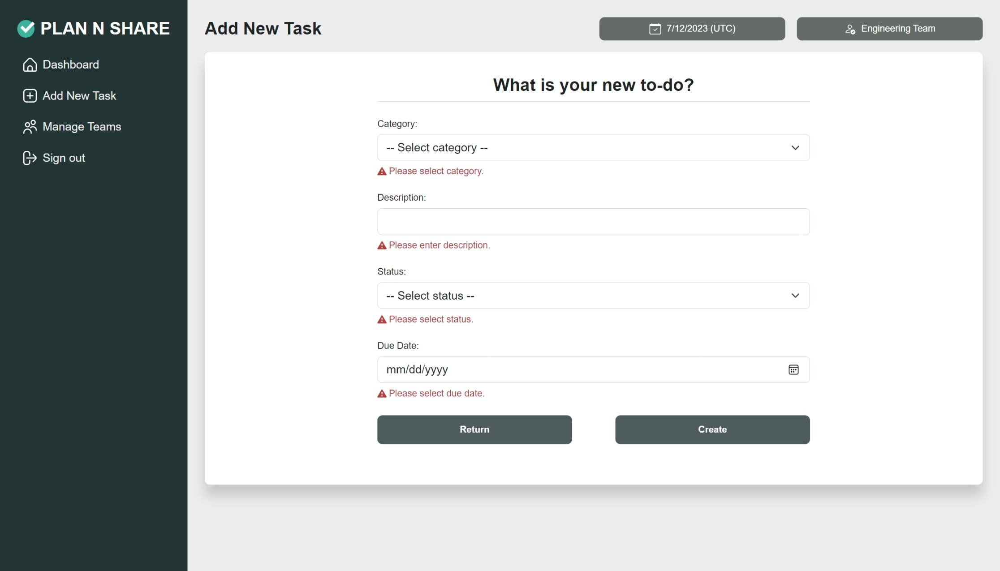
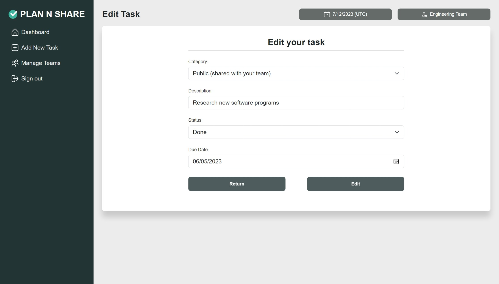
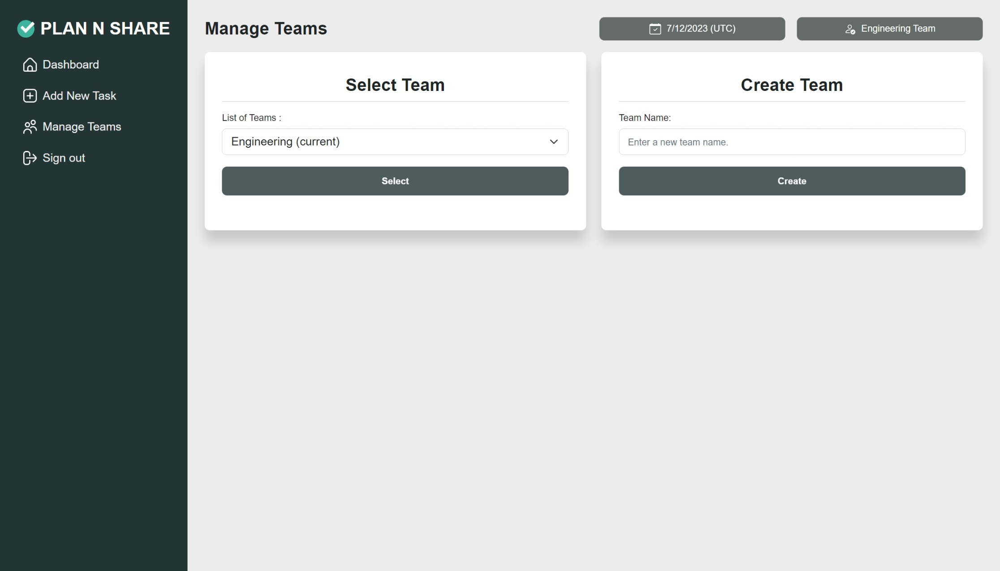
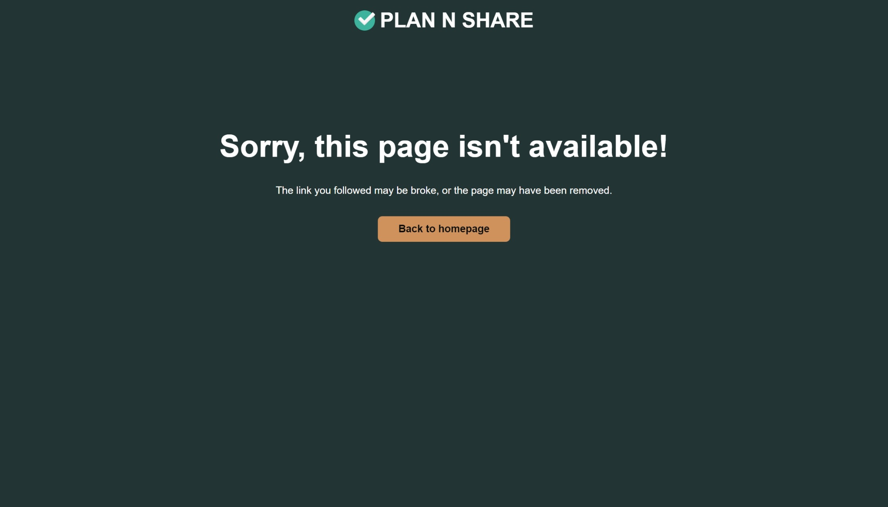
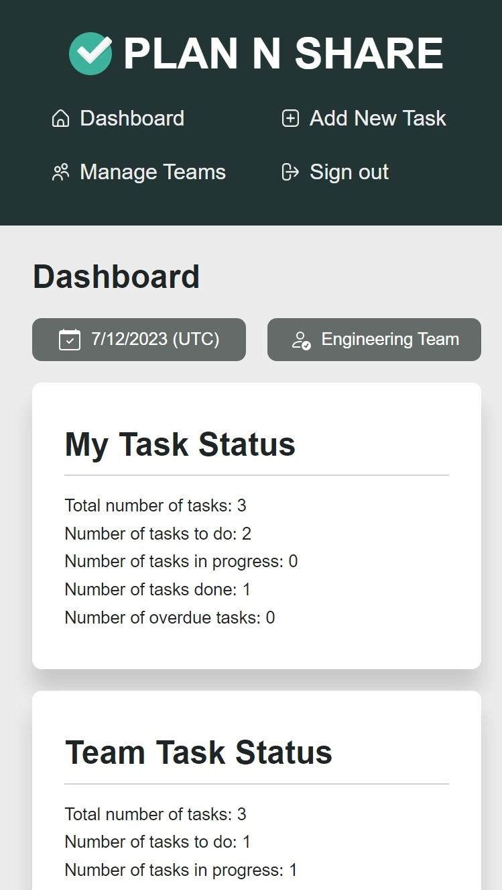
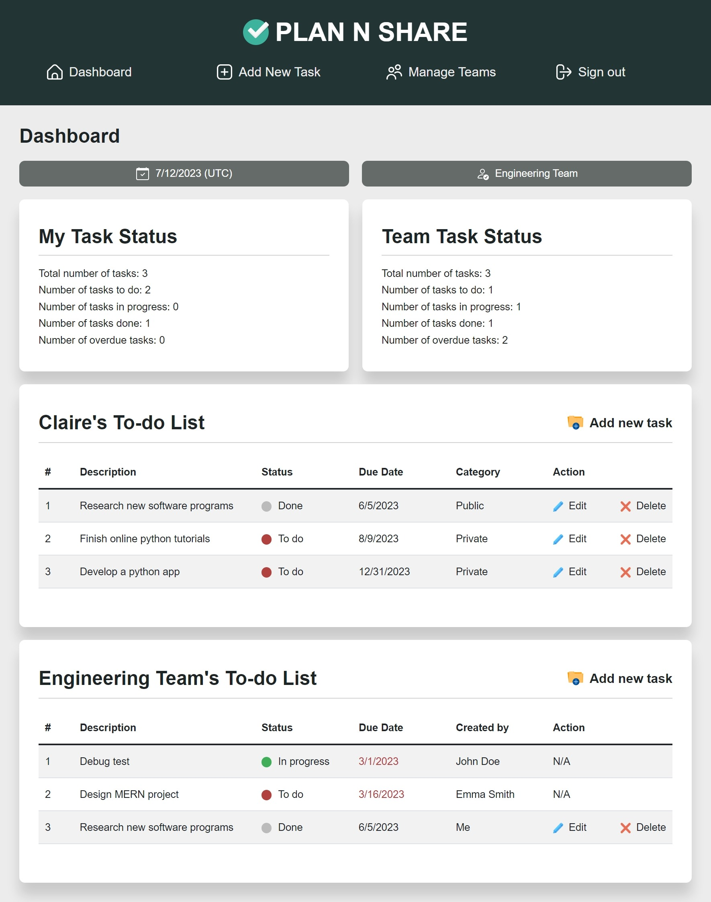

<!-- omit in toc -->
# Plan N Share

<!-- omit in toc -->
## Description
This is a to-do list web application that helps user's work management.The app is built with `Python Flask` framework, `Jinja2` templating engine, and `MySQL` database in mobile-first-responsive design. After registering and signing in, user must create a new team or join one among the existing teams. Once the team is selected, user can create either a private or public to-do item with description, status, due date and category. The private task items are only shown to the user, while the public task items are shared with other teammates. User can also edit/delete a task item or switch teams.


You can check out the deployed application from the link below:


## Table of Contents

- [Table of Contents](#table-of-contents)
- [Technologies](#technologies)
- [Installation](#installation)
- [Usage](#usage)
- [License](#license)

## Technologies
Project is created with:
- Python Flask
- Jinja2
- MySQL
- Bootstrap

## Installation
- Install [Python](https://www.python.org/downloads/windows/)
- Install virtual environment tool using pip.
  - Install [pip](https://pypi.org/project/pip/) (Python version 3.4+ includes pip by default).
  - Install pipenv using a command `pip install pipenv`
- Install [MySQL Server](https://dev.mysql.com/doc/mysql-getting-started/en/#mysql-getting-started-installing)


## Usage
1. Navigate to the project's root directory.
    ```
    cd <project_root_directory_name>
    ```
2. Change the name of `.env.EXAMPLE` file to `.env`.
3. Enter your MySQL username and MySQL password in the `.env` file:
    ```yaml
    DB_NAME='plan_n_share_db'
    DB_USER='<your_mysql_username>'
    DB_PASSWORD='<your_mysql_password>'
    ```
4. Create database and seed the test data to your database with MySQL shell commands:
    ```
    mysql -u root -p
    Enter password: <your_mysql_password>
    mysql> source flask_app/db/schema.sql;
    mysql> source flask_app/db/seeds.sql;
    mysql> quit;
    ```
5. Launch the virtual environment:
    ```
    pipenv shell
    ```
6. Install all dependencies saved in Pipfile, if needed:
    ```
    pipenv install
    ```
7. Run the app:
    ```
    (project_root_directory_name) project_root_directory_name $ python server.py
    ```

<!-- omit in toc -->
### Index page ⬇️


<!-- omit in toc -->
### Registration page ⬇️


<!-- omit in toc -->
### Dashboard page ⬇️


<!-- omit in toc -->
### Add new task page ⬇️


<!-- omit in toc -->
### Edit task page ⬇️


<!-- omit in toc -->
### Manage teams page ⬇️


<!-- omit in toc -->
### Error page ⬇️


<!-- omit in toc -->
### Responsive design for screens smaller than 768px ⬇️


<!-- omit in toc -->
### Responsive design for screens between 768px and 992px ⬇️



## License
Copyright © 2023 [Claire Hyung Won Cho ](https://github.com/clairehwcho),

